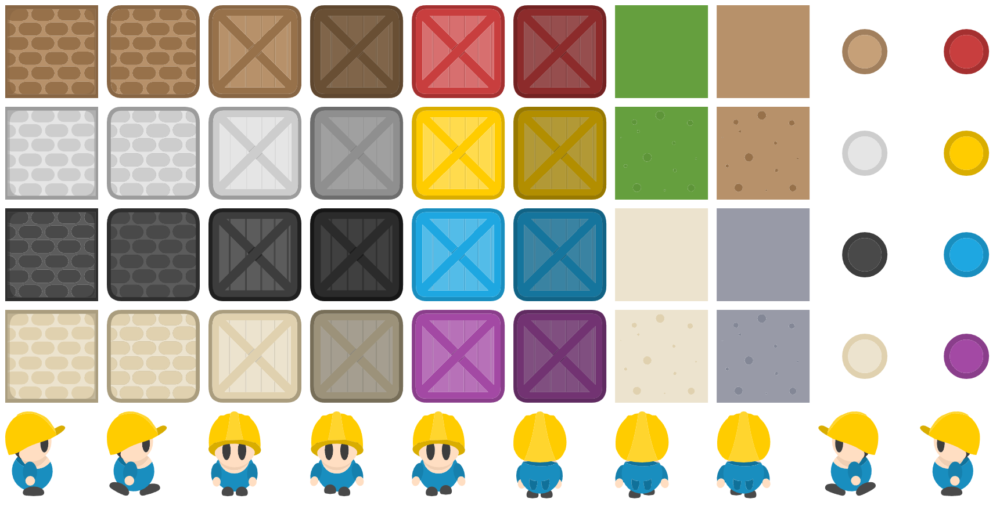
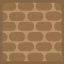

# sokoban-ebiten-assets

Contains [Sokoban](https://en.wikipedia.org/wiki/Sokoban) assets published by
[1001.com](https://opengameart.org/content/sokoban-pack) on
[OpenGameArt.Org](https://opengameart.org/content/sokoban-pack) for use in
[Ebiten](https://ebiten.org/).

## Assets

| Asset name              | Preview                                                               |
| ----------------------- | --------------------------------------------------------------------- |
| `Character1`            |                        |
| `Character2`            |                        |
| `Character3`            |                        |
| `Character4`            |                        |
| `Character5`            |                        |
| `Character6`            |                        |
| `Character7`            |                        |
| `Character8`            |                        |
| `Character9`            |                        |
| `Character10`           |                      |
| `Crate_Beige`           |                      |
| `Crate_Black`           |                      |
| `Crate_Blue`            |                        |
| `Crate_Brown`           |                      |
| `Crate_Gray`            |                        |
| `Crate_Purple`          |                    |
| `Crate_Red`             |                          |
| `Crate_Yellow`          |                    |
| `CrateDark_Beige`       |              |
| `CrateDark_Black`       |              |
| `CrateDark_Blue`        |                |
| `CrateDark_Brown`       |              |
| `CrateDark_Gray`        |                |
| `CrateDark_Purple`      |            |
| `CrateDark_Red`         |                  |
| `CrateDark_Yellow`      |            |
| `EndPoint_Beige`        |                |
| `EndPoint_Black`        |                |
| `EndPoint_Blue`         |                  |
| `EndPoint_Brown`        |                |
| `EndPoint_Gray`         |                  |
| `EndPoint_Purple`       |              |
| `EndPoint_Red`          |                    |
| `EndPoint_Yellow`       |              |
| `Ground_Concrete`       |              |
| `Ground_Dirt`           |                      |
| `Ground_Grass`          |                    |
| `Ground_Sand`           |                      |
| `GroundGravel_Concrete` |  |
| `GroundGravel_Dirt`     |          |
| `GroundGravel_Grass`    |        |
| `GroundGravel_Sand`     |          |
| `Wall_Beige`            |                        |
| `Wall_Black`            |                        |
| `Wall_Brown`            |                        |
| `Wall_Gray`             |                          |
| `WallRound_Beige`       |              |
| `WallRound_Black`       |              |
| `WallRound_Brown`       |              |
| `WallRound_Gray`        |                |

